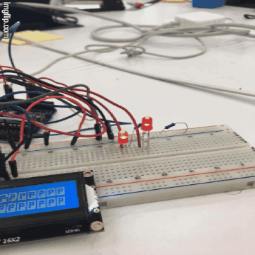
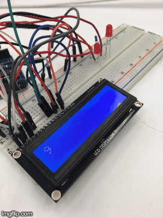

# Hanging by a Thread: Concurrency on an Arduino 
## Allison Basore and Anusha Datar

# Project Vision

The goal of our project was to write the appropriate firmware to support threading on an Arduino Uno. In doing so, we hoped to implement several different methods of handling concurrent processes and create interesting examples that leverage this functionality. 

Our MVP (minimum viable product) functionality included:
- An functioning threading API for embedded targets implemented in C 
- Documentation of functionality for basic threading examples (blinking different LEDs without interruption) on an Arduino Uno

Our stretch goals included:
- Include support for advanced hazard control (including semaphores)
- Develop advanced examples (such as a solution for the producer-consumer problem on an LCD display)

# Results
## Threading Framework
Our target platform, the Arduino Uno, is a single core device which does not support truly parallel tasks. To implement a threading framework, we leveraged the \_\_LINE\_\_ macro to simulate the execution of multiple processes. 

To do this, we first define a single struct made up of a short. Each thread uses one of these lightweight variables to coordinate execution.
~~~
typedef unsigned short pass_t;
#define PASS_INITALIZE(p) p = 0;
~~~
Threads can then call the resume, set, or clear method to start the program associated with the thread, resume the previous process, or end the thread.
~~~
#define PASS_RESUME(p) switch(p) { case 0:
#define PASS_SET(p) p = __LINE__; case __LINE__:
#define PASS_CLEAR(p) }
~~~

Along with a single `pass` object, each thread also uses four status signals to note which of the four possible states the thread is in: waiting to start, running until the original process resumes, closing, or clearing.
~~~
//  If the thread is waiting on some other process.
#define THREAD_WAITING 0
// If the thread is held until resumed.
#define THREAD_YIELDED 1
// If the thread has been exited.
#define THREAD_CLOSED  2
// If the thread has been removed. 
#define THREAD_CLEARED 3
~~~
Each state has a set of definitions associated with it to set the value of the `pass` struct to the necessary state to either start the new process, resume the original process, or close and clear the `thread` struct itself. 

For example, the `THREAD_START` method produces a thread
~~~
#define THREAD_START(thread) { PASS_RESUME((thread)->pass)
~~~

A more complicated case is the `THREAD_WAIT_UNTIL` method, which waits until some value passed to it has been set.
~~~
#define THREAD_WAIT_UNTIL(thread, trigger) \
    do { \
        PASS_SET((thread)->pass); \
        if(!(trigger)) \ 
	     { \
	         return THREAD_WAITING; \
	     } \
	} while (0)
~~~

The reason that all of the definitions must be preprocessor macros instead of standard source code is because the \_\_LINE\_\_ macro directly alters the control flow of the program and needs to be set up prior to when the remainder of the code compiles. For that reason, each thread operates in the same space and does not have its own stack, so any function controlling a thread cannot call other functions defined locally without interrupting the threading process.
## Semaphores
We also created a versatile concurrency struct for more advanced applications. Each semaphore contains a single integer counter.
~~~
struct semaphore {
	int counter;
};
~~~
Each semaphore struct hold a thread until a the flag variable passed to it has been signaled.
~~~
#define SEMAPHORE_WAIT(t, p)  \
  do { \
    THREAD_WAIT_UNTIL(t, (p)->counter > 0); \
    --(p)->counter; \
  } while(0) 
~~~
To signal, increment the counter.
~~~
#define SEMAPHORE_SIGNAL(t, p) ++(p)->counter
~~~
Multiple semaphores can signal to each other to coordinate processes. This is especially useful when working with shared data structures. 

Because the semaphore struct is a wrapper for a single integer, they can quickly be adapted for use cases that would otherwise involve synchronization structures such as condition variables or mutexes. 
## Examples

Throughout the project we consistently developed various examples that would best display the threading functionality. We used basic Arduino functions and materials including printing to the Serial monitor, blinking LEDs, and printing to LCD displays. More information about how to use the examples can be found in the project [README](https://github.com/anushadatar/SoftSysHangingByAThread/blob/master/README.md). Below are highlights from a few of the examples:

- [Simple_Print](https://github.com/anushadatar/SoftSysHangingByAThread/blob/master/examples/simplePrint/simplePrint.ino): This example is the best place to get starting using the library. Simple_Print, creates two threads and manages their scheduling with flag conditional variables. The threads wait for each other to finish. They run infinitely and print a statement with each loop.

For this example, two threads are declared and initialized.

~~~
static struct thread thread1, thread2;
THREAD_INITALIZE(&thread1);
THREAD_INITALIZE(&thread2);
~~~

Each thread can have a task-specific function. This example implements the same task for both threads: printing a statement to the console. The threads use WAIT_UNTIL the other thread is finished.

~~~

static int example1(struct thread *thread)
{
  THREAD_START(thread);
  while(1) {
    THREAD_WAIT_UNTIL(thread, flag2 != 0);
    Serial.println("Protothread 1 running\n");
    /* Flip the flags so the other thread can run. */
    flag2 = 0;
    flag1 = 1;
  }
  THREAD_CLEAR(thread);
}
~~~

//Screenshot of Print statements

- [Blink_With_Threads](https://github.com/anushadatar/SoftSysHangingByAThread/blob/master/examples/blinkWithThreads/blinkWithThreads.ino): With an Object-Oriented implementation of an LED blinker, Blink_With_Threads creates two LED objects, two threads. Each thread wraps an LED object. By setting variable on and off times for the LED on each thread, the threads display their overlapping processes. The LED blinker object counts milliseconds to update its state. For simplicity, the blinker object can be abstracted to a simple on/off state class for an LED.

- [Basic_Semaphore](https://github.com/anushadatar/SoftSysHangingByAThread/blob/master/examples/basic_semaphore_example/basic_semaphore_example.ino): This example uses a basic semaphore implementation along with the thread library to simulate the Producer-Consumer problem. Basic_Semaphores exemplifies how to create a bounded buffer that handles tasks from a producer and consumer. A producer thread adds to the buffer until it reaches capacity and then a consumer thread removes from until it is empty.

This example first creates producer and consumer threads and the necessary semaphores.
~~~
static struct thread producer_thread, consumer_thread;
SEMAPHORE_INIT(&empty, 0);
SEMAPHORE_INIT(&full, BUFFER_SIZE);
THREAD_INITIALIZE(&producer_thread);
THREAD_INITIALIZE(&consumer_thread);
~~~

Each thread has a task management function.

~~~
static int producer(struct thread *thread) {
  static int total_produced;
  THREAD_START(thread);
  for(total_produced = 0; total_produced < TOTAL_NUM_ITEMS; ++total_produced) {
    // Wait until the buffer is empty.
    SEMAPHORE_WAIT(thread, &empty);
    int value = total_produced;
    buffer[buffer_pointer] = value;
    // Move buffer pointer, signal accordingly.
    buffer_pointer = (buffer_pointer + 1) % BUFFER_SIZE;
    SEMAPHORE_SIGNAL(thread, &full);
  }
  THREAD_CLEAR(thread);
}

static int consumer(struct thread* thread) {
  static int total_consumed;
  THREAD_START(thread);
  // Go through the total number of values to remove from the buffer.
  for(total_consumed = 0; total_consumed < TOTAL_NUM_ITEMS; ++total_consumed) {
    // Wait until the buffer is full.
    SEMAPHORE_WAIT(thread, &full);
    // Print the value.
    int value;
    value = (int) buffer[buffer_pointer];
    // Move buffer pointer, signal accordingly.
    buffer_pointer = (buffer_pointer + 1) % BUFFER_SIZE;
    SEMAPHORE_SIGNAL(thread, &empty);
  }
  THREAD_CLEAR(thread);
}
~~~

- [LCD_With_Semaphores](https://github.com/anushadatar/SoftSysHangingByAThread/blob/master/examples/LCDSemaphores/LCDSemaphores.ino): Simular to Basic_Semaphore and Blink_With_Threads, LCD_With_Semaphores uses the thread and semaphore implementation to manage a producer/consumer system. The LCD screen displays the count and the semaphore value.

# Reflection

When we started this project our learning goals included learning more about threading and general C programming, especially in the context of embedded programming. We wanted to use this project to explore the complexity of thread management and the different strategies used to implement threading on a simple target such as the Arduino Uno. Additionally, we wanted to learn practical design using C programming - ideally, any other developer should be able to easily leverage our threading framework into their own programs.

In large part, our learning goals did not change throughout the project. Through our initial research, we were developed a general understanding of protothreading. By implementing the thread library and the basic examples we had the chance to put that knowledge to use.

Developing the additional concurrency structure and more advanced examples solidified out understanding with practical design in C. Additionally-, we had the opportunity to develop communication skills by writing documentation around our library.

Overall, we feel that we achieved our learning goals, and in doing so we were able to meet our stretch goals of implementing advanced examples.

# Resources

We studied several examples of existing threading frameworks:
- [Protothreading Guide](https://create.arduino.cc/projecthub/reanimationxp/how-to-multithread-an-arduino-protothreading-tutorial-dd2c37)
- [mthread Library](https://github.com/jlamothe/mthread)
- [Concurrency with Arduino](http://concurrency.cc/)

We also referenced the following general material about concurrency, especially about embedded applications, for background for our project.
- [The Little Book of Semaphores](http://greenteapress.com/semaphores/LittleBookOfSemaphores.pdf)
- [How to Use Semaphores](https://barrgroup.com/Embedded-Systems/How-To/RTOS-Mutex-Semaphore)
- [Semaphores in Arduino](https://www.hackster.io/feilipu/using-freertos-semaphores-in-arduino-ide-b3cd6c)

Overall we found Adam Dunkel's [library documentation](http://dunkels.com/adam/pt/expansion.html) for learning about how these threads work and how we can implement them highly valuable.

